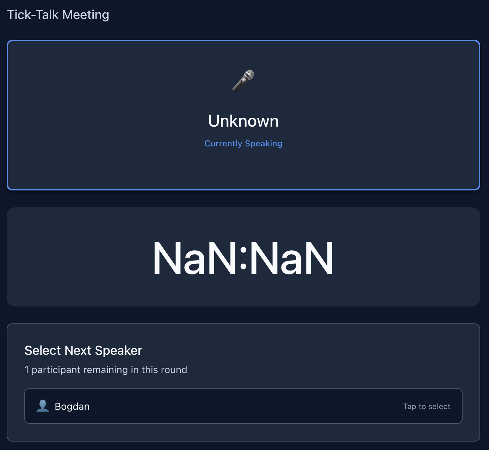

# REQ-0015: UI Polish — Idle State Messaging and Edge Case Handling

**Status**: ✅ Completed  
**Priority**: Medium (UX Polish)  
**Dependencies**: REQ-0008, REQ-0009

---

## Overview

Improve user experience by refining UI messaging and handling edge cases in the transition between lobby and active meeting states. When a meeting is "active" but no speaker has been selected, and timer values are invalid or NaN, the app should display clear, helpful feedback instead of generic or numeric placeholders.

This requirement enhances components created in REQ-0008 (ActiveSpeaker), REQ-0009 (Timer), and the meeting page to reduce confusion and improve psychological safety.

Current visual Meeting Room display that should be polished:

1. "Unknown" → "Waiting for speaker" in ActiveSpeaker.tsx
2. "NaN:NaN" → "..." in Timer.tsx (when the timer value is invalid/NaN)

---

## Acceptance Criteria

- [x] ActiveSpeaker component displays "Waiting for speaker" when no active speaker (instead of "Unknown")
- [x] Timer component displays "..." when timer value is NaN or invalid (instead of "NaN:NaN")
- [x] Message reflects context: host sees "Select the first speaker to begin", participants see "Waiting for speaker selection..."
- [x] All fallback messages use consistent, clear language
- [x] No breaking changes to existing component interface
- [x] Updates applied to both component code and documentation examples
- [x] Messages tested across desktop and mobile layouts

---

## User Experience Improvements

| Scenario | Before | After |
|----------|--------|-------|
| Meeting active, no speaker selected | "Unknown" (confusing) | "Waiting for speaker" (clear) |
| Timer NaN due to race condition | "NaN:NaN" (error-like) | "..." (loading indicator) |
| Host starting meeting | No clear next action text | "Select the first speaker to begin" |
| Participant waiting for speaker | Generic text | "Waiting for speaker selection..." |

---

## Edge Cases Handled

- **Network latency**: Timer shows "..." during brief NaN state instead of broken display
- **Missing participant data**: ActiveSpeaker gracefully falls back with clear message
- **First speaker selection**: Host sees actionable prompt; participants see waiting state
- **Mobile responsiveness**: All messages remain readable across screen sizes

---

## Testing Notes

- Verify messages display correctly in both dark and light modes
- Test on mobile (small viewport) to ensure no text truncation
- Simulate network delay to observe "..." state
- Confirm messages are visible in accessibility tools (screen readers, high contrast)

---

## Files Modified

1. `components/ActiveSpeaker.tsx` — line 79
2. `components/Timer.tsx` — lines 13–17, 42–44
3. `app/meeting/[sessionId]/page.tsx` — lines 230–231
4. `docs/stories/completed/REQ-0008-active-speaker-display.md` — line 170

---

## Completion Date

Completed: February 21, 2026
